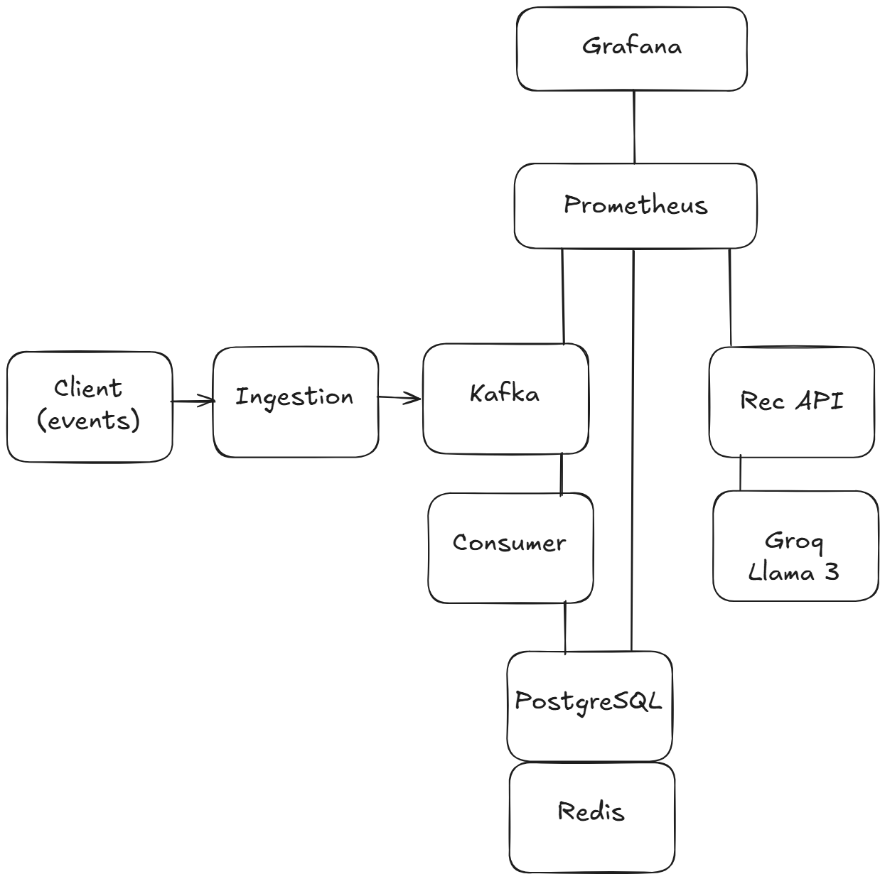

# RecSys - Event-Driven Recommendation Engine

A production-grade recommendation pipeline that processes user behavioral signals (clicks, views, purchases) through Apache Kafka, aggregates engagement scores in PostgreSQL, serves real-time recommendations via FastAPI with Redis caching, and uses LLM re-ranking (Groq/Llama 3.3) to generate intelligent explanations.

## Architecture



**Data flow:** Client POST `/events` -> Ingestion Service -> Kafka `user-events` topic -> Consumer (upserts `score += weight` in PostgreSQL, invalidates Redis cache) -> Recommendation API queries top-N scores with Redis cache-aside -> Optional LLM re-ranking with explanations via Groq.

## Tech Stack

| Layer | Technology |
|-------|-----------|
| API Framework | FastAPI (async) |
| Message Queue | Apache Kafka 3.7 (KRaft mode, no ZooKeeper) |
| Database | PostgreSQL 16 + SQLAlchemy 2.0 async + asyncpg |
| Cache | Redis 7 (async, cache-aside pattern) |
| LLM | Groq API / Llama 3.3 70B |
| Metrics | Prometheus + Grafana |
| Validation | Pydantic v2 |
| Logging | structlog (JSON) |
| Containerization | Docker + Docker Compose |
| Language | Python 3.10+ |

## Event Weights

| Event Type | Weight | Description |
|-----------|--------|-------------|
| `view` | 0.5 | User viewed an item |
| `click` | 1.0 | User clicked on an item |
| `purchase` | 3.0 | User purchased an item |

## Details

This starts **8 containers**: PostgreSQL, Redis, Kafka, Ingestion API, Consumer, Recommendation API, Prometheus, and Grafana. The `migrate` container runs Alembic migrations automatically and exits.


Grafana comes pre-loaded with the **"RecSys Pipeline"** dashboard showing:
- Ingestion events/sec by type
- Kafka publish latency (p50/p95/p99)
- Recommendation requests/sec by source
- Recommendation latency percentiles
- Cache hit/miss ratio
- Consumer processing rate and latency

## API Reference

### Ingestion Service (:8001)

#### `POST /events`
Accept a behavioral event. Returns `202 Accepted`.

```json
{
  "user_id": "user_42",
  "item_id": "item_7",
  "event_type": "click",
  "timestamp": "2026-04-05T12:00:00Z"
}
```

#### `GET /health`
Health check.

#### `GET /metrics/`
Prometheus metrics.

### Recommendation API (:8002)

#### `GET /recommendations/{user_id}?limit=10&explain=false`

| Param | Type | Default | Description |
|-------|------|---------|-------------|
| `limit` | int | 10 | Number of recommendations (1-100) |
| `explain` | bool | false | Enable LLM re-ranking with explanations |

**Response:**
```json
{
  "user_id": "user_42",
  "items": [
    {
      "item_id": "item_7",
      "score": 12.5,
      "rank": 1,
      "explanation": "Recommended because you frequently engage with this item"
    }
  ],
  "source": "llm"
}
```

Sources: `score` (DB), `cache` (Redis hit), `llm` (re-ranked), `llm_cache` (cached LLM result).

#### `GET /health`
Health check.

#### `GET /metrics/`
Prometheus metrics.

## Project Structure

```
RecSys/
├── common/                  # Shared package
│   ├── db/                  # SQLAlchemy engine, ORM models, queries
│   ├── kafka/               # Producer/consumer wrappers
│   ├── models/              # Pydantic schemas (events, recommendations)
│   └── logging.py           # structlog config (JSON/console)
├── ingestion_service/       # POST /events -> Kafka
├── consumer_service/        # Kafka -> PostgreSQL upsert + Redis invalidation
├── recommendation_api/      # GET /recommendations + LLM re-ranking
│   ├── llm_reranker.py      # Groq/Llama 3.3 with timeout + fallback
│   ├── routes.py            # Endpoints with caching
│   └── middleware.py        # X-Response-Time header
├── scripts/
│   └── simulate_traffic.py  # Zipf-distributed traffic generator
├── alembic/                 # Database migrations
├── prometheus/              # Scrape configs
├── grafana/                 # Provisioning + dashboard JSON
├── tests/                   # 21 tests (unit + integration)
├── docker-compose.yml       # Infrastructure only (Postgres, Redis, Kafka)
├── docker-compose.prod.yml  # Full stack (infra + services + observability)
├── docker-compose.observability.yml  # Prometheus + Grafana
├── Dockerfile               # Multi-stage (ingestion, consumer, recommendation)
└── pyproject.toml           # Poetry dependencies
```

